# Java

## 关键字

### volatile
> - 特性:\
>   **可见性** 修饰的变量被修改时，其他线程能立刻可见(因为每次都是从内存获取，而不是查询线程缓存)\
>   **顺序性** 读写操作都是按顺序执行的，不会指令重排序
> - 场景:\
>   **控制标识位** 控制多个线程之间的状态如等待、停止等\
>   **双重检查锁定模式** 多线程环境下实现延迟单例模式

### final
> **final修饰的对象** 对象的引用就不能被修改\
> **final修饰list** list不能被重新赋值，即引用不能被修改，但是它里面的元素可以随意修改

## 数据结构

### List
> ```java
>  // list分片
>  Lists.partition
> ```
> #### ArrayList
> 原理: 数组
> 
> 特点: 线程不安全
> 
> #### LinkedList
> 原理: 链表
>
> 特点: 线程不安全
> 
> #### Vector
> 原理: 
>
> 特点: 线程安全

### Map
> 
> #### HashMap
> > 描述:
> >  
> > 特点: 线程不安全
> >
> > 缺点:
> > > 元素覆盖，两线程同时插入相同桶中，导致一个元素被另一个元素覆盖\
> > > 无限循环，一个线程在修改，另一个线程在遍历，可能遍历线程会无限循环
> > 
> > 场景:
> > > 只能在单线程使用，多线程环境下，使用Hashmap进行put操作会引起死循环，导致CPU利用率接近100%，所以在并发情况下不能使用HashMap。
> > 
> > 底层:
> > - 节点类型:\
> > jdk1.6-1.7 位桶(数组)+链表\
> > jdk1.8 位桶(数组)+链表+红黑树 （链表长度达到8，链表转为红黑树）
> > - 把key通过hashCode()生成哈希值\
> > 哈希冲突，多个键计算出相同的哈希值，则会把它们以链表的形式存储在数组同一位置，然后遍历链表查找特定键值对，链表长度超过8且hashMap容量超过64会将链表转为红黑树
> > 
> > 扩展:\
> > 二叉树
> > > 红黑树 自平衡二叉搜索树
> > > 时间复杂度O(log n)
> > > 
> > > 
> > > 
> > > 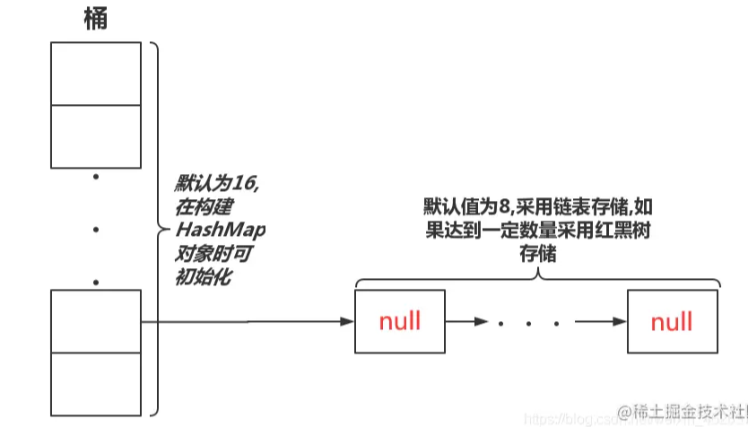
> 
> 
> #### ConcurrentHashMap
> > 
> > 描述: 一个支持高并发更新与查询的哈希表(基于HashMap)
> > 
> > 特点: 线程安全
> > 
> > 场景:
> > > 多线程高并发场景\
> > > ConcurrentHashMap是J.U.C包里面提供的一个线程安全并且高效的HashMap，所以ConcurrentHashMap在并发编程的场景中使用的频率比较高。
> > > 
> > > ```java 
> > >   // 常用方法 基本跟hashMap一样
> > >   map.putIfAbsent("key","value1");
> > > ```
> > 
> > 底层:
> > - JDK1.7节点类型:​Segment数组(内部包含HashEntry数组)
> >   - ​ConcurrnetHashMap 由很多个 Segment 组合，Segment个数初始化后不能改变(默认16个)，每个Segment是类似HashMap结构，每个HashMap内部可以扩容
> >   - ​分段锁:锁分离技术，减少锁的粒度，Segment数组的意义就是将一个大的table分割成多个小的table来进行加锁，Segment 继承了 ReentrantLock，所以 Segment 内部可以很方便的获取锁，`tryLock() 获取锁`，获取不到使用 scanAndLockForPut 方法继续获取
> >   - hash冲突解决方式 开放地址法
> > 
> > 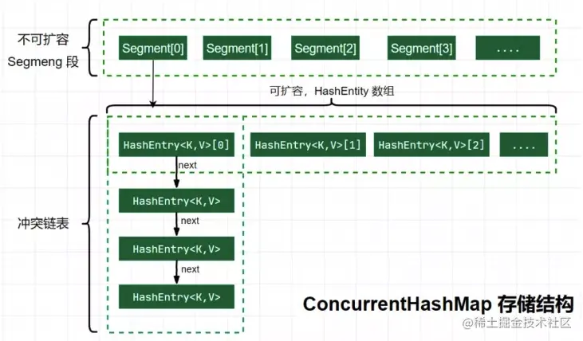
> > 
> > - JDK1.8节点类型:数组+链表/红黑树+CAS
> >   - CAS核心算法:执行函数:CAS(V，E，N)
> >     1. V表示准备要被更新的变量 （内存的值）
> >     2. E表示我们提供的 期望的值 （期望的原值）
> >     3. N表示新值 ，准备更新V的值 （新值）
> > HashEntry对象组成的链表长度`超过8时，或数组长度小于64 就会扩容`，否则链表转换为红黑树，提升性能。底层变更为数组＋链表＋红黑树
> >   - hash冲突解决方式 链表/红黑树
>
> 
### Queue
> 描述:\
> 特点: 元素按照插入顺序排列，先进先出\
> 底层:\
> 场景:
> > 适用于按照特定顺序处理元素的场景，例如任务调度、消息传递等
>
> 
> #### ArrayBlockingQueue
> > 描述: 有界阻塞队列\
> > 特点: 线程安全\
> > 底层:
> > > 内部是定长数组，初始化时确定大小，无法修改\
> > > 使用可重入锁(ReentrantLock)保证线程安全
> 
> #### ConcurrentLinkedQueue
> > 描述: 链接节点并发队列\
> > 特点: 线程安全 可被多个线程同时访问修改\
> > 底层:\
> > 场景: 适合高并发环境队列操作
>
> #### DelayQueue
> > 描述: 延时无界阻塞队列\
> > 特点:
> > > 线程安全
> > > 只有延时期满才能获取元素
> >
> > 底层:\
> > 场景:
> > > 缓存系统
> > > 定时任务调度系统
> 
> #### LinkedBlockingQueue
> > 描述: 链表双向阻塞队列\
> > 特点: 
> > > 线程安全\
> > > 队列大小可选，默认是 Integer.MAX_VALUE,内部采用容量可调的数组或链表存储元素，当队列满时，会阻塞插入操作，当队列空时，会阻塞取出操作;LinkedBlockingQueue的存储容量不受限制，但是在实际使用时，**应根据实际场景进行合理的容量设置**，避免内存不足的情况\
> > > 支持公平性策略，即按照线程请求的顺序来处理队列中的元素
> > > 提供了多种构造函数和一些方法，如 put、take、offer、poll 等，以便于控制队列的插入和删除行为
> >
> > 底层: 链表
> > 场景: 
> > >LinkedBlockingQueue 不应该用于实现生产者-消费者模式的任务处理系统，因为它的容量是有限的，当队列已满时，生产者线程会被阻塞，导致整个系统的性能下降。对于这种情况，更适合使用无界队列，例如 ArrayBlockingQueue。
> > >
> >


> #### LinkedTransferQueue
> > 描述:
> > > 链表阻塞队列
> > > 功能和LinkedBlockingQueue类似，更丰富
> >
> > 特点:
>
> #### PriorityQueue
> > 描述:无界队列 
> > 特点:
> > > - 线程不安全
> > > - 无序，默认自然排序，可自定义comparator 
> > 底层:数组
> 
> #### PriorityBlockingQueue
> > 描述: 无界阻塞队列\
> > 特点:
> > > 线程安全\
> > > 无序，默认自然排序，可自定义comparator\
> > > 队列空获取元素会阻塞线程直到有数据，队列满了插入元素也会阻塞线程直到有空闲\
> >
> > 底层:二叉堆
> 
> #### SynchronousQueue
> > 描述: 不存储元素的阻塞队列\
> > 特点:
> > > 没有容量、不存储元素\
> > > 每个插入操作必须等待一个对应的删除操作\
> > > 公平(即按照线程的到达顺序来进行处理)、非公平访问策略(默认)
> >
> > 底层:\
> > 场景: 传递性场景 生产者消费者场景 吞吐量较高

### 参考文档
<https://juejin.cn/post/7156200349685317663>


## 注解
### @Retryable
方法异常重试

```java
    @Retryable(value = Exception.class,maxAttempts = 3,backoff = @Backoff(delay = 100,multiplier = 1))
    public void add(List<ReqVo> add){
        
    }
```


## 线程

### 进程和线程关系

进程 静态的，可以启动多个，比如qq.exe，一个程序进入内存，会产生一个主线程
线程 动态的，一个alu只能执行一个

alu 算术逻辑单元 计算机数学大脑 负责运算的组件

### 线程状态

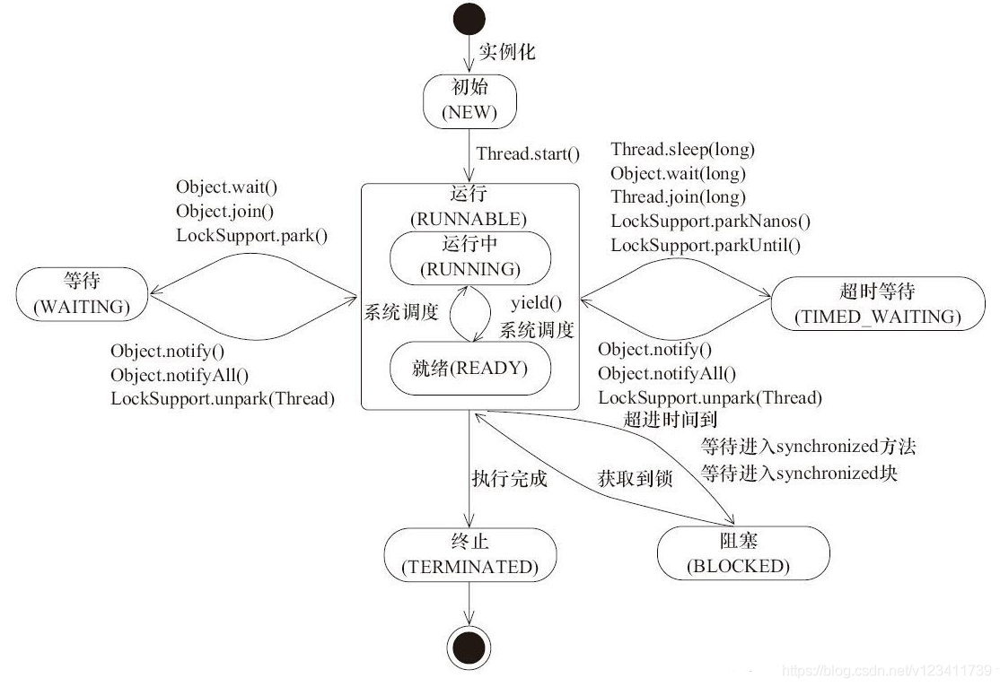


### 线程创建方式
#### Runnable

#### Thread

#### Callable

#### 线程池
> 不推荐使用Executors创建线程\
> 推荐使用new ThreadPoolExecutor()的方式,根据服务器核心数自定义线程参数
> 
> ```
> @Bean("myExecutor")
>     public ExecutorService myExecutor() {
>         ExecutorService ex = new ThreadPoolExecutor(
>                 2,
>                 2,
>                 0L,
>                 TimeUnit.MILLISECONDS,
>                 new LinkedBlockingQueue<>(100),// 指定任务数量
>                 new CustomThreadFactory(),
>                 (r, e) -> log.error("异常"));
>         return ex;
>     }
> ```

### 线程池
#### 线程池工作流程


#### 线程池类型

##### Executors.newFixedThreadPool
> 描述: 
> > 创建一个指定工作线程数量的线程池。每当提交一个任务就创建一个工作线程，如果工作线程数量达到线程池初始的最大数，则将提交的任务存入到池队列中。
> 
> 特点:
> > 是一个典型且优秀的线程池，它具有线程池提高程序效率和节省创建线程时所耗的开销的优点。但是，**没任务时，不会释放工作线程，占用系统资源**
> 
> 底层: 
> > nThreads参数表示线程池中最多运行两个线程\
> > LinkedBlockingQueue线程池任务队列，把任务放这等待执行，用到了不设容量的链表阻塞队列，容易导致内存不足
> > ```java
> > public static ExecutorService newFixedThreadPool(int nThreads, > ThreadFactory threadFactory) {
> >         return new ThreadPoolExecutor(nThreads, nThreads,
> >                                       0L, TimeUnit.MILLISECONDS,
> >                                       new LinkedBlockingQueue<Runnable>(),
> >                                       threadFactory);
> >     }
> > ```

##### Executors.newCachedThreadPool
> 描述: 一个可缓存的线程池
> 
> 特点:
> > 线程池中的**线程数是根据任务的数量动态调整的**，没任务时会释放线程，有任务时才创建工作线程\
> > 1. 工作线程的创建数量几乎没有限制(其实也有限制的,数目为Interger. MAX_VALUE), 这样可灵活的往线程池中添加线程，同时创建大量线程时，有可能造成系统瘫痪
> > 2. 如果长时间没有往线程池中提交任务，即如果工作线程空闲了指定的时间(默认为1分钟)，则该工作线程将自动终止
> 
> 底层:
> >SynchronousQueue任务队列，使用没有存储能力的阻塞队列，主要目的是为了实现一个具有动态调整线程数的线程池\
> >如果没有空闲线程可用，SynchronousQueue 的特性决定了任务必须等待一个空闲线程。在这种情况下，线程池会创建一个新的线程来处理任务。
> > ```java
> > public static ExecutorService newCachedThreadPool() {
> >         return new ThreadPoolExecutor(0, Integer.MAX_VALUE,
> >                                       60L, TimeUnit.SECONDS,
> >                                       new SynchronousQueue<Runnable>());
> > }
> > ```
> 

##### Executors.newSingleThreadExecutor
> 创建一个单线程化的Executor，即只创建唯一的工作者线程来执行任务，如果这个线程异常结束，会有另一个取代它，保证顺序执行。单工作线程最大的特点是可保证**顺序地执行**各个任务，并且在任意给定的时间不会有多个线程是活动的 。
> PS:至始至终都只有一个线程，那用线程池干嘛呢？直接创建一个新的线程不就可以了嘛，不懂！

##### Executors.newScheduleThreadPool
> 创建一个定长的线程池，而且支持定时的以及周期性的任务执行，类似于Timer。

### 相关

#### submit()、execute()区别
> JDK5往后，任务分两类:一类是实现了Runnable接口的类，一类是实现了Callable接口的类。两者都可以被ExecutorService执行，\
> 它们的区别是:\
> execute(Runnable x) 没有返回值。可以执行任务，但无法判断任务是否成功完成。——实现Runnable接口\
> submit(Runnable x) 返回一个future。可以用这个future来判断任务是否成功完成。——实现Callable接口

#### invokeAll()、invokeAny()区别
> invokeAll触发执行任务列表，返回的结果顺序也与任务在任务列表中的顺序一致.所有线程执行完任务后才返回结果。如果设置了超时时间，未超时完成则正常返回结果，如果超时未完成则报异常。\
> invokeAny将第一个得到的结果作为返回值，然后立刻终止所有的线程。如果设置了超时时间，未超时完成则正常返回结果，如果超时未完成则报超时异常。\
> 1、invallkeAll和invokeAny会直接造成主线程阻塞（需要设置超时时间）。等待所有任务执行完成后返回结果，主线程继续执行。\
> 2、submit不会造成主线程阻塞，在后面执行get方法的时候阻塞。超时时间在get里面设置。\
> 3、execute会新开启线程直接执行任务，不会阻塞主线程。但无返回结果。


#### cpu

##### cpu缓存一致性协议
>
>​	cpu负责运算，将运算结果输出到主内存，主内存读写速度不够，cpu在中间加了三级缓存，工业上实践得出，采用三级缓存性价比最好，缓存之间信息同步需要缓存一致性协议
>
>
>
>

##### CPU的*伪共享*

> **当多线程修改互相独立的变量时，如果这些变量共享同一个缓存行，就会无意中影响彼此的性能，这就是伪共享**。

##### cpu乱序执行


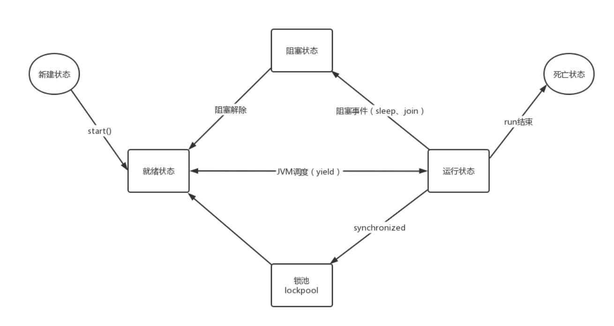

1、future类

2、thread.join() 需要等待线程执行完

#### 线程池无界队列引发的内存飙升
<https://juejin.cn/post/6844903769025544206>


## jvm

### 基础

> Jdk包括了Jre和Jvm，Jre包括了Jvm
> 
> - Jdk是我们编写代码使用的开发工具包
> - Jre 是Java的运行时环境，他大部分都是 C 和 C++ 语言编写的，他是我们在编译java时所需要的基础的类库
> - Jvm俗称Java虚拟机，他是java运行环境的一部分，它虚构出来的一台计算机，在通过在实际的计算机上仿真模拟各种计算机功能来实现Java应用程序
> 
> 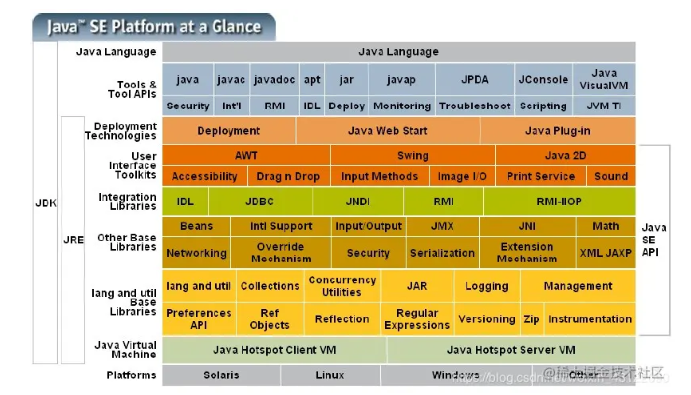
> 
> jvm内部组成
> 
> 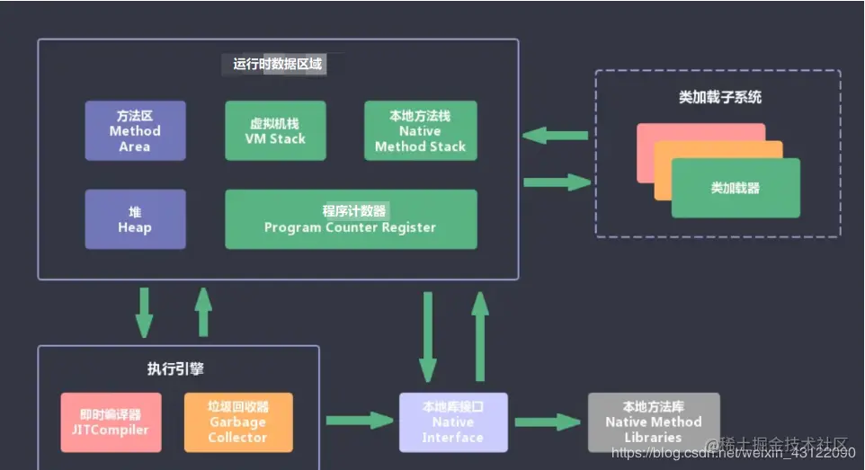

### 线程

> 类型:应用线程\系统线程 或者 守护线程\非守护线程\
> 系统线程:\
> **Compile Threads**:运行时将字节码编译为本地代码所使用的线程\
> **GC Threads**:包含所有和 GC 有关操作\
> **Periodic Task Thread**:JVM 周期性任务调度的线程，主要包含 JVM 内部的采样分析\
> **Singal Dispatcher Thread**:处理 OS 发来的信号(OS是操作系统)\
> **VM Thread**:某些操作需要等待 JVM 到达 **安全点（Safe Point）** ，即堆区没有变化。比如:GC 操作、线程 Dump、线程挂起 这些操作都在 VM Thread 中进行。

### 类加载器

> 应用类加载器，加载我们classpath目录下的所有类文件\
> 扩展类加载器，加载标准 Java 类库扩展的类，就是你的jre目录下的/lib/ext目录下的所有类\
> 根类加载器（bootstrap classloader），扫描 BootClassPath 下的 标准 Java 类库的类加载器。标准 Java 类库限制了一些包路径的类，必须通过根类加载器加载。

### 类实例化

> 明确的实例化:
> 
> > 明确调用`new`。\
> > 调用`Class`或者`java.lang.reflect.Constructor`对象的`newInstance`方法。\
> > 调用任何现有对象的`clone`。\
> > 通过`java.io.ObjectInputStream.getObject()`反序列化。
> 
> 隐含的实例化:
> 
> > 可能是保存命令行参数的`String`对象。\
> > 对于Java虚拟机装载的每个类，都会暗中实例化一个Class对象来代表这个类型\
> > 当Java虚拟机装载了在常量池中包含`CONSTANT_String_info`入口的类的时候，它会创建新的`String`对象来表示这些常量字符串。\
> > 执行包含字符串连接操作符的表达式会产生新的对象。

### 监控工具

> Prometheus

### 垃圾回收
#### 手动垃圾回收
> 代码执行 System.gc()
> jmap触发
> jvmti( JVM Tool Interface)

#### System.gc
> 危害:
> > System.gc 其实是做一次 full gc，full gc 会暂停整个进程。如果进程经常被频繁暂停，就要注意超时、并发等问题\
> > 通过 -XX:+DisableExplicitGC 禁掉 System.gc
> 
> 原理: 
> > Java 里面的 GC 有一个重要的线程 **VMThread**。在 jvm 里，这个线程会不断轮询它的队列，这个队列里主要是存一些 VM_operation 的动作，比如最常见的就是内存分配失败要求做 GC 操作的请求等，在对 gc 这些操作执行的时候会先将其他业务线程都进入到**安全点**，也就是这些线程从此不再执行任何字节码指令，只有当出了安全点的时候才让他们继续执行原来的指令，因此这其实就是我们说的 **stop the world(STW)**，整个进程相当于静止了。
>

#### 并行的 Full GC
> 并行 Full GC 也同样会做 YGC 和 CMS GC，但是效率高就搞在 CMS GC 是走的 background 的，整个暂停的过程主要是 YGC、CMS_initMark、CMS_remark 几个阶段。\
> background 顾名思义是在后台做的，也就是可以不影响正常的业务线程跑，触发条件比如说 old 的内存占比超过多少的时候就可能触发一次 background 式的 cms gc，这个过程会经历 CMS GC 的所有阶段，该暂停的暂停，该并行的并行，效率相对来说还比较高，毕竟有和业务线程并行的 gc 阶段；\
> 而 foreground 则不然，它发生的场景比如业务线程请求分配内存，但是内存不够了，于是可能触发一次 cms gc，这个过程就必须是要等内存分配到了线程才能继续往下面走的，因此整个过程必须是STW的，因此 CMS GC 整个过程都是暂停应用的，但是为了提高效率，它并不是每个阶段都会走的，只走其中一些阶段，这些省下来的阶段主要是并行阶段。

#### 防止长时间GC

> 排查顺序
> >
> 
> 参数调优 (参考 『吞吐量』、『停顿时间』和『垃圾回收频率』)
> > 内存策略
> > > -Xmx:设置堆的最大值\
> > > -Xms:设置堆的初始值\
> > > -Xmn:表示年轻代的大小\
> > > -XX:SurvivorRatio:伊甸区和幸存区的比例等等\
> > > IO密集型的可以稍微把「年轻代」空间加大些，因为大多数对象都是在年轻代就会灭亡\
> > > 内存计算密集型的可以稍微把「老年代」空间加大些，对象存活时间会更长些
> >
> > 垃圾回收器、垃圾回收调优参数
> > > -XX:+UseG1GC:指定 JVM 使用的垃圾回收器为 G1\
> > > -XX:MaxGCPauseMillis:设置目标停顿时间\
> > > -XX:InitiatingHeapOccupancyPercent:当整个堆内存使用达到一定比例，全局并发标记阶段 就会被启动等等
> >
> > 命令
> > > jps命令查看Java进程「基础」信息（进程号、主类）。这个命令很常用的就是用来看当前服务器有多少Java进程在运行\
> > > jstat命令查看Java进程「统计类」相关的信息（类加载、编译相关信息统计，各个内存区域GC概况和统计）。这个命令很常用于看GC的情况\
> > > jinfo命令来查看和调整Java进程的「运行参数」\
> > > jmap命令来查看Java进程的「内存信息」。这个命令很常用于把JVM内存信息dump到文件，然后再用MAT( Memory Analyzer tool 内存解析工具)把文件进行分析\
> > > jstack命令来查看JVM「线程信息」。这个命令用常用语排查死锁相关的问题\
> > > Arthas（阿里开源的诊断工具）\
> > > 
> >
> Thread.sleep(0)\
> 可数循环:for (int i=0...)\
> 不可数循环:for(long i=0...)
> 

### oom 

> 内存溢出场景
> > 1、对象生命周期过长\
> > 2、无限递归\
> > 3、大数据集合\
> > 4、jvm配置不当
> 
> 内存泄漏
> > 内存泄漏 表示就是我们申请了内存，但是该内存一直无法释放；
> > 内存泄漏会导致[内存溢出](https://so.csdn.net/so/search?q=内存溢出&spm=1001.2101.3001.7020)问题: 申请内存时，发现申请内存不足，就会报错 ；

### 参考文档
<https://blog.csdn.net/weixin_39633054/article/details/111646187>
<https://juejin.cn/post/7139741080597037063#comment>
<https://juejin.cn/post/7034669867286396958>


## 设计模式
### 单例模式
#### 创建过程
> 1、创建实例\
> 2、构造器私有化（外部不能使用构造器创建对象）\
> 3、返回实例的方法

#### 饿汉式
> 线程安全，调用效率高，但是不能延时加载
> ```java
> public  class Tong{
>     private  static Tong instance = new Tong;
>     private Tong(){}
>     public static  Tong getInstance(){
>         return instance;
>     }
> }
> ```
#### 懒汉式
> 线程安全，调用效率不高，但是能延时加载
> ```java
> public class Tong {
>     private static Tong tong;
>     private Tong() {
> 
>     }
>     public static synchronized Tong Tong() {
>         if (tong == null) {
>             tong=new Tong();
>         }
>         return tong;
>     }
> }
> ```

#### 双重检查
> DCL也就是双重锁判断机制（由于JVM底层模型原因，偶尔会出问题，不建议使用）
> > ```java
> > public class Tong {
> >   private static Tong tong;
> >   private Tong(){}
> >   public static Tong getInstance(){
> >       if(tong==null){
> >           synchronized (Tong.class){
> >               if(tong==null){
> >                   tong= new Tong();
> >               }
> >           }
> >       }
> >       return tong;
> >   }
> > }
> > ```
> 
> 上面的也不好，发生cpu指令重排序的话，还是会有点问题，但是发生概率不怎么高\
> volatile版本
> > ```java
> > 
> > class Foo {  
> >     private volatile Helper helper = null;
> >     private Foo(){}  
> >     public Helper getHelper() {  
> >         if (helper == null) {  
> >             synchronized (this) {  
> >                 if (helper == null)  
> >                  //（jvm new对象的过程 申请内存->变量初始化->赋值给helper）
> >                     helper = new Helper();//指令重排序 上面的顺序乱了，可能会导致对象值不准，volatile可以防止指令重排序
> >             }  
> >         }  
> >         return helper;  
> >     }  
> > }  
> > ```


#### 静态内部类实现模式
> 线程安全，调用效率高，可以延时加载
> ```java
> public class Tong {
>     
>     private  static class TongInstance{
>         private final static Tong tongInstance=new Tong();
>     }
>     private Tong(){}
>     public static Tong getInstance(){
>         return TongInstance.tongInstance;
>     }
> }
> ```

### 工厂模式
### 策略模式
### 责任链模式

创建型模式(5种)：工厂方法模式、抽象工厂模式、单例模式、建造者模式、原型模式。

结构型模式(7种)：适配器模式、装饰器模式、代理模式、外观模式、桥接模式、组合模式、享元模式。

行为型模式(11种)：策略模式、模板方法模式、观察者模式、迭代子模式、责任链模式、命令模式、备忘录模式、状态模式、访问者模式、中介者模式、解释器模式。

## spring

> ### 事务
> #### ACID特性
> > ##### 原子性 (Atomicity）
> > > 一个事务内涉及到分布式多个节点的所有操作要么一起成功，要么一起失败。
> > ##### 一致性 (Consistency)
> > > (事务结果要和真实结果一致)\
> > > 跨节点场景下也不能出现中间状态。上面转账的例子中，A和B的数据可能不在一个节点上，转账的全程依然要保持A+B都为100块，不存在其他的结果。
> > ##### 隔离性（Isolation）
> > > 多个事务并发执行时，互相隔离，互不干扰
> > ##### 持久性 (Durability)
> > > 事务提交完成后的数据不仅要在当前节点保存，还应该在分布式场景下有备份，具备高可用性。
> #### 隔离级别
> > todo
> #### 参考文档
> <https://juejin.cn/post/7237439385909592122#heading-11>

## spingcloud


参考资料

https://blog.csdn.net/mkmkmkhh/article/details/101996991?utm_medium=distribute.pc_relevant.none-task-blog-baidujs_baidulandingword-2&spm=1001.2101.3001.4242

### 组件
#### Spring Cloud Security
#### Eureka(停更)
服务注册中心
#### Hystrix
1,服务降级
比如当某个服务繁忙,不能让客户端的请求一直等待,应该立刻返回给客户端一个备选方案
2,服务熔断
当某个服务出现问题,卡死了,不能让用户一直等待,需要关闭所有对此服务的访问然后调用服务降级
3,服务限流
限流,比如秒杀场景,不能访问用户瞬间都访问服务器,限制一次只可以有多少请求
#### Zuul
#### Ribbon 
可以用LoadBalance代替
#### Feign
现在用openFeign
OpenFeign默认使用ribbon做负载均衡，超时时间是由ribbon控制
#### spring Cloud Alibaba
包含nacos
#### Spring Cloud Zookeeper
#### Spring Cloud Config
#### Spring Cloud Bus
#### Archaius
#### Consul
#### Spring Cloud for Cloud Foundry
#### Spring Cloud Sleuth
#### Spring Cloud Data Flow
#### Spring Cloud Stream
#### Spring Cloud CLI
#### Turbine
#### Spring Cloud Task
#### Spring Cloud Connectors
#### Spring Cloud Cluster
#### Spring Cloud Starters


### 事务传播机制


## maven

### 清理仓库文件脚本

```
set REPOSITORY_PATH=E:mymavenmyLocalRepository
rem 正在搜索...
for /f "delims=" %%i in ('dir /b /s "%REPOSITORY_PATH%*lastUpdated*"') do (
    del /s /q %%i
)
rem 搜索完毕
pause
```


## 数据库

### Sharding-Jdbc

#### 基础

> sharding-jdbc是ShardingSphere（分布式数据库生态系统）的一个组成部分，是轻量级java框架
>
> ##### 绑定表
> > 分片规则一致的主表和子表
> ##### 广播表
> > 表结构和数据在数据库中都一致，适用数据量不大但需要与海量数据表进行关联查询的场景，例如字典表

#### 功能

> 数据分片，分布式事务，读写分离等，其中使用最多的就是数据分片

#### 数据分片

> ##### 分片键
> > 用于分片的字段，用于拆分数据库或表的字段
> 
> ##### 分片算法
> 
> ​	1、精确分片算法
> 
> > 对应PreciseShardingAlgorithm，用于处理使用**单一键**作为分片键的=与IN进行分片的场景。需要配合StandardShardingStrategy使用
> 
> ​	2、范围分片算法
> 
> > 对应RangeShardingAlgorithm，用于处理使用**单一键**作为分片键的BETWEEN AND、>、<、>=、<=进行分片的场景。需要配合StandardShardingStrategy使用。
> 
> ​	3、复合分片算法
> 
> > 对应ComplexKeysShardingAlgorithm，用于处理使用**多键**作为分片键进行分片的场景，包含多个分片键的逻辑较复杂，需要应用开发者自行处理其中的复杂度。需要配合ComplexShardingStrategy使用。
> 
> ​	4、Hint分片算法
> 
> > 对应HintShardingAlgorithm，用于处理使用Hint行分片的场景。需要配合HintShardingStrategy使用
> 
> ##### 分片策略(分片键+分片算法)
> 
> 1、标准分片策略
> 
> > 对应StandardShardingStrategy。提供对SQL语句中的=, >, <, >=, <=, IN和BETWEEN AND的分片操作支持。StandardShardingStrategy只支持**单分片键**，提供PreciseShardingAlgorithm和RangeShardingAlgorithm两个分片算法。PreciseShardingAlgorithm是必选的，用于处理=和IN的分片。RangeShardingAlgorithm是可选的，用于处理BETWEEN AND, >, <, >=, <=分片，如果不配置RangeShardingAlgorithm，SQL中的BETWEEN AND将按照全库路由处理。
> 
> 2、复合分片策略
> 
> > 对应ComplexShardingStrategy。复合分片策略。提供对SQL语句中的=, >, <, >=, <=, IN和BETWEEN AND的分片操作支持。ComplexShardingStrategy支持多分片键，由于**多分片键**之间的关系复杂，因此并未进行过多的封装，而是直接将分片键值组合以及分片操作符透传至分片算法，完全由应用开发者实现，提供最大的灵活度。
> 
> 3、行表达式分片策略
> 
> > 对应InlineShardingStrategy。使用Groovy的表达式，提供对SQL语句中的=和IN的分片操作支持，只支持**单分片键**。对于简单的分片算法，可以通过简单的配置使用，从而避免繁琐的Java代码开发，如: t_user_$->{u_id % 8} 表示t_user表根据u_id模8，而分成8张表，表名称为t_user_0到t_user_7。
> 
> 4、Hint分片策略
> 
> > 对应HintShardingStrategy。通过Hint指定分片值而非从SQL中提取分片值的方式进行分片的策略
> 
> 5、不分片策略
> 
> > 对应NoneShardingStrategy。不分片的策略。
> 


## 分布式

### 分布式追踪系统 
> **自定义日志跟踪系统**
> > 手动生成taceId放请求头里在各个服务中使用
> 
> **skywalking**
> > 开源的应用性能监控和分析系统
> 
> Zipkin
> > 开源，提供了收集、存储和展示跨多个服务的请求追踪数据的功能。使用Zipkin可以追踪请求在分布式系统中的传输路径，并对请求的性能进行可视化展示
>
> Jaeger
> > 开源的端到端的分布式追踪系统
>
> OpenTracing
> 
> Dapper
> > Google开发的
>
> HTrace
> > 在Apache Software Foundation下开源 
>
> X-Trace


### 分布式锁
> 
> #### 场景
> 
> > 防止重复点击\
> > 控制任务调度 （某定时任务某时刻只能执行一次这种）
> 
> #### 实现
> > setIfAbsent
> > 
> > ```java
> >  String lockKey = RedisConstant.LOCK+id;
> >  Boolean lock = redisCache.opsForValue().setIfAbsent(lockKey, id, 10, TimeUnit.SECONDS);
> >   if (Objects.equals(lock,Boolean.FALSE)){
> >     // 没拿到锁稍后再试  直接返回 或者 休眠重试
> >   }
> >   // 拿到锁继续执行
> > ```
> 
> #### 难点
> 任务没执行完锁过期的情况
> > 正常都应该先预估好任务执行时间来设置过期时间，尽量减少这种情况，特殊情况还是发生了的话，可以根据具体场景用以下处理方式\
> > **执行中状态标记**: 在缓存加个任务执行状态标记，尝试获取锁时先检查是否有任务在执行中\
> > **队列机制**: 获取锁后先把任务放到队列里，从队列中获取待执行任务，任务放在队列中等待，就可以不依赖锁的状态\
> > **分布式协调工具**: 使用分布式协调工具如ZooKeeper、etcd或Consul等来实现分布式锁。这些工具提供了更健壮和可靠的分布式锁机制，并能够解决锁过期的问题。它们通常基于分布式一致性算法实现，可以确保锁在任务执行完成前不会过期。

### 分布式事务
> #### 特性
> > 原子性（Atomicity）：所有事务操作必须被视为一个整体，一旦其中一个操作失败，则整个事务必须回滚，以确保所有节点上的数据状态一致。\
> > 一致性（Consistency）：在事务开始和结束时，所有节点的数据必须处于一致状态。这意味着所有参与者必须遵守相同的规则和约束条件，以确保整个事务的一致性。\
> > 隔离性（Isolation）：不同的事务应该相互隔离，以避免互相干扰和结果不确定性。\
> > 持久性（Durability）：一旦事务提交，所做的更改必须在所有节点上被持久化，以确保数据不会因节点故障或其他原因而丢失。
> #### 场景
> > 保证订单、库存、支付等一致性可靠性
> #### 算法
> ##### 共识算法
> > 用于在分布式系统中达成一致意见的算法。\
> > 它们被设计为在存在网络延迟、节点故障和恶意节点的情况下，使得多个节点能够就某个事务或决策达成一致。
> ##### Paxos
> > Paxos是一种经典的共识算法，用于解决分布式一致性问题。它通过一系列提议、承诺和接受阶段来达成共识。
> ##### Raft
> > Raft是一种相对较新的共识算法，与Paxos类似，但比Paxos更易于理解和实现。Raft将共识问题划分为领导者选举、日志复制和安全性三个子问题，并通过这些子问题的机制来实现一致性。
> > 1. 名词
> >    - 复制状态机
> ##### Byzantine Fault Tolerance (BFT)算法
> > BFT算法是一类针对拜占庭容错问题设计的共识算法。它能够在有恶意节点存在的情况下保证系统的一致性，适用于对安全性要求较高的场景。
> ##### Practical Byzantine Fault Tolerance (PBFT)算法
> > PBFT是一种BFT算法的具体实现，旨在解决拜占庭容错问题。它通过节点之间的互相通信和消息交换来达成一致，要求超过两个-thirds的节点是诚实和正常工作的。
>
> #### 理论
> > ##### 两阶段提交
> > > 描述: 包含准备阶段、提交阶段\
> > > 实现: 
> > > 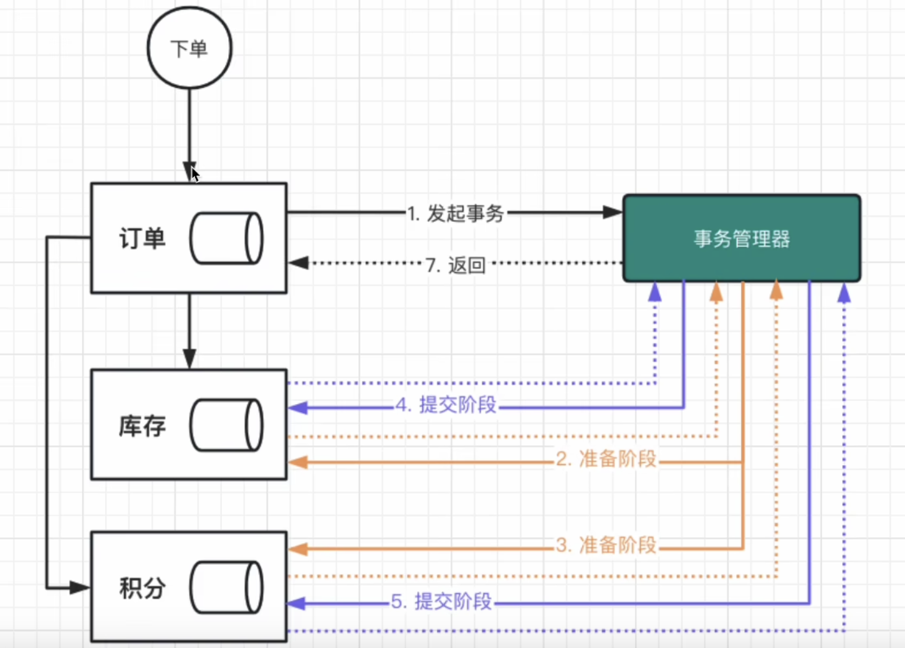
> > > 缺点: 多个服务都依赖事务管理器，系统并发能力下降\
> > > 难点: 协调者和参与者之间通信故障怎么处理
> > > 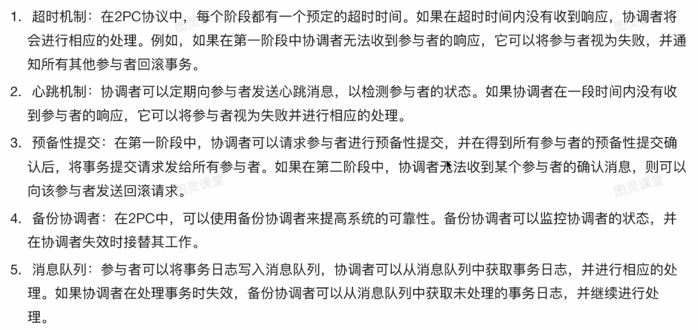
> >
> > ##### 三阶段提交
> > > 描述: 跟二阶段相比第三阶段失败有时也允许提交事务
> > > 
> >
> > ##### AT模式
> > > 描述: 二阶段提交的变种，多了**补偿机制**
> > >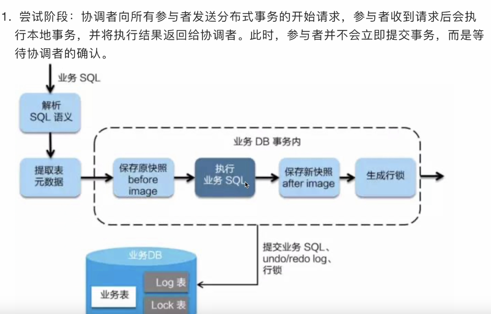
> > >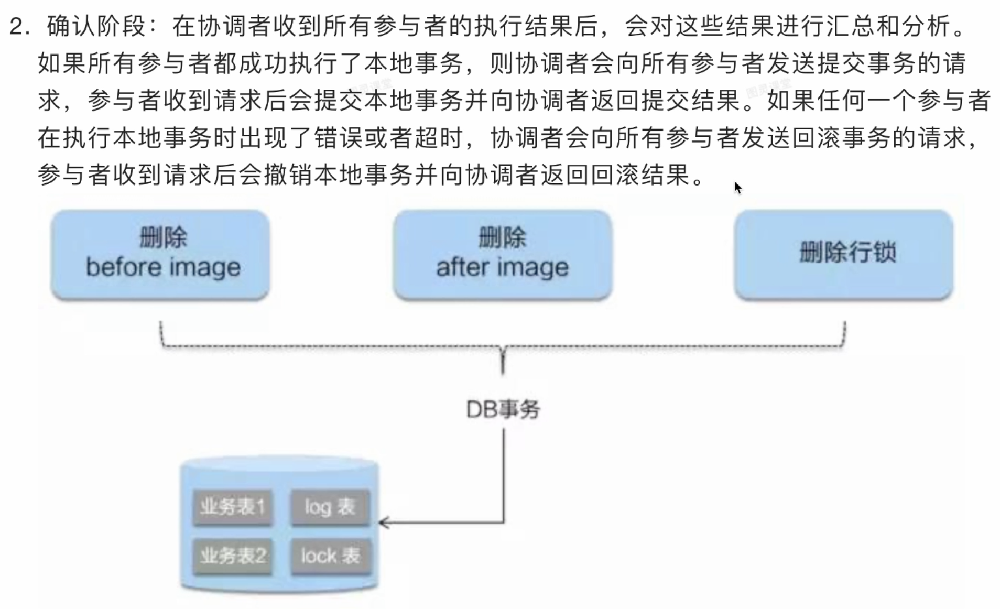
> > >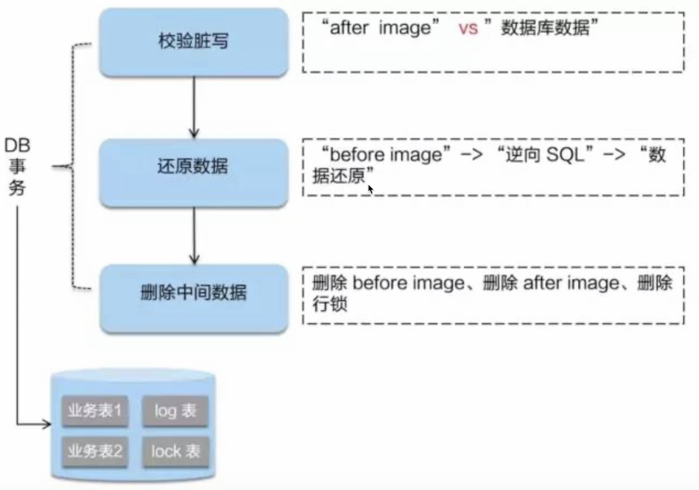
> > ##### TCC模式
> > > 描述: 基于补偿机制的分布式协议，通过三个阶段实现事务原子性、一致性
> > >
> > ##### sega模式
> > > 基于事件方式\
> > > 基于命令方式
>
> #### 实现
> > ##### ali seta
> > > 用于对性能要求比较低的场景\
> > > 对代码有侵入\
> > > 原理：
> > > > Ali SETA 将事务分为 TCC 事务和 SAGA 事务两种类型。   todo
> > >
> > ##### 异步消息补偿
> > > 用于对性能要求比较高的场景\
> > > 在服务异常时记录下来，或者放入消息队列，异步做补偿机制


## 业务场景
### 秒杀

redis

jmeter压测

。。。。


## 本地缓存

本地缓存方案中的应用进程和缓存进程在同一个进程，没有网络开销，访问速度快，但受限于内存，不适合存储大量数据。本地缓存主要有Guava cache，Caffeine，Encache等，还可以通过HashMap自实现一套本地缓存机制。

### @Cacheable

cacheManager 缓存管理器
cacheResolver 缓存解析器
配置一种缓存时不用指定，多个的时候需要指定使用哪一种缓存

#### 参考文档

https://blog.csdn.net/qq_44936392/article/details/121476927

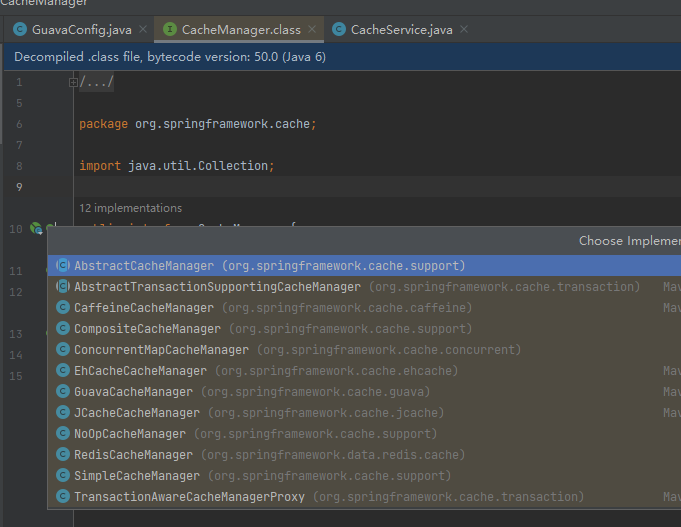

### guava

#### 描述
guava缓存是谷歌开源的一种本地缓存，缓存是使用本机的内存来存储的，实现原理类似于java老版本ConcurrentHashMap

#### 使用方式
1、导包

```
		<dependency>
			<groupId>com.google.guava</groupId>
			<artifactId>guava</artifactId>
			<version>19.0</version>
		</dependency>
```

2、

#### 缓存清除策略
① 基于存活时间的清除策略
	expireAfterWrite 写缓存后多久过期
	expireAfterAccess 读写缓存后多久过期
	存活时间策略可以单独设置或组合配置
② 基于容量的清除策略
	通过CacheBuilder.maximumSize(long)方法可以设置Cache的最大容量数，当缓存数量达到或接近该最大值时，Cache将清除掉那些最近最少使用的缓存

③ 基于权重的清除 策略
	使用CacheBuilder.weigher(Weigher)指定一个权重函数，并且用CacheBuilder.maximumWeight(long)指定最大总重。

#### 原理
vending用到的
参考文档
https://blog.csdn.net/zw147258369/article/details/125484533

### Caffeine
#### 描述
#### 使用方式

1、导包

```
        <dependency>
            <groupId>com.github.ben-manes.caffeine</groupId>
            <artifactId>caffeine</artifactId>
        </dependency>
```

resource-management-system用到的

### Encache

https://blog.csdn.net/weixin_42072632/article/details/125091305


## 底层

### 字节码插件 jclasslib 

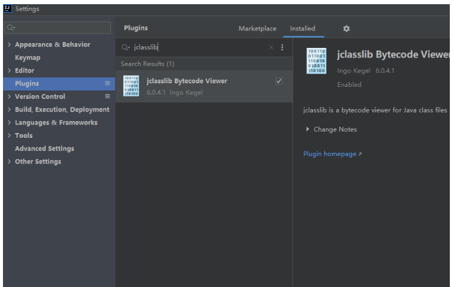

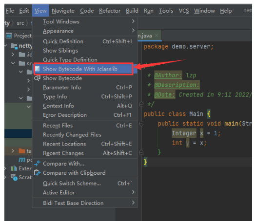


### 动态代理

jdk

cglib

https://juejin.cn/post/6844904036202905614


动态加载是个难题，包你都重新打了，不打包你的class没法加载到虚拟机内存中，重启是免不了的。
通用的方案就是集群，高级一点的，可以看看osgi或spring module


## kafka

```
 ./kafka-topics.sh --bootstrap-server PLAINTEXT://124.223.75.221:9092 --create --topic topicName2
 ./kafka-topics.sh --bootstrap-server PLAINTEXT://VM-4-11-centos:9092 --create --topic topicName
 ./kafka-topics.sh --bootstrap-server PLAINTEXT://zk:9092 --create --topic topicName
 
```


```
        //将fos.txt文件中所有字符读取回来
        File file = new File("C:\\Users\\fm00894\\Desktop\\新建文件夹 (3)\\1.txt");
        FileInputStream fis = new FileInputStream(file);
        byte[] bytes = new byte[(int)file.length()];
        fis.read(bytes);
        /*
            String提供的构造器
            String(byte[] data,Charset charset)
            将给定的字节数组data中所有的字节按照给定的字符集charset转换为一个字符串
         */
        String line = new String(bytes, StandardCharsets.UTF_8);
//        System.out.println(line);

        fis.close();
```


学习

异步线程，traceid丢失问题

https://tech.meituan.com/2023/04/20/traceid-google-dapper-mtrace.html


## 学习资料

1、网站


2、电子书


多线程事务
https://mp.weixin.qq.com/s/vN6zOECK_PDXltJ8k22h0A


分布式锁
[Zookeeper 都有哪些应⽤场景？] [使⽤ Redis 如何设计分布式锁？使⽤ Zookeeper 来设计分布式锁可以吗？以上两种分布式锁的实现⽅
式哪种效率⽐较⾼？]
分布式事务
[分布式事务了解吗？你们如何解决分布式事务问题的？TCC 如果出现⽹络连不通怎么办？XA 的⼀致性
如何保证？]
分布式会话
[集群部署时的分布式 Session 如何实现？]
⾼可⽤架构
[Hystrix 介绍] [电商⽹站详情⻚系统架构]
[Hystrix 线程池技术实现资源隔离]
[Hystrix 信号量机制实现资源隔离]
[Hystrix 隔离策略细粒度控制] [深⼊ Hystrix 执⾏时内部原理] [基于 request cache 请求缓存技术优化批量商品数据查询接⼝] [基于本地缓存的 fallback 降级机制] [深⼊ Hystrix 断路器执⾏原理] [深⼊ Hystrix 线程池隔离与接⼝限流] [基于 timeout 机制为服务接⼝调⽤超时提供安全保护]
⾼可⽤系统
如何设计⼀个⾼可⽤系统？
限流
如何限流？在⼯作中是怎么做的？说⼀下具体的实现？
熔断
如何进⾏熔断？
熔断框架都有哪些？具体实现原理知道吗？

&emsp;降级  
&ensp;降级  
&nbsp;降级
如何进⾏降级？


官网
https://square.github.io/okhttp/
okhttp3 
  是java语言封装的请求库
流式接口
websocket

undownloadprogress


## 乱七八糟的代码记得整理

```
@EnableFeignClients
@FeignClient(contextId = "ecologyClient", name = "${saas.ecologyClient.feign.name:ECOLOGY-ADMIN-APPLICATION}", url = "${saas.ecologyClient.feign.url}")
public interface EcologyClient {

    @PostMapping(value = "/ecology/api/token/getAppAccessToken")
    EcologyBaseResponse<EcologyGetAppAccessTokenResponse> getAppAccessToken(@RequestBody EcologyGetAppAccessTokenRequest request);
}


@Override
@Cacheable("menu")
public Menu findById(String id) {
    Menu menu = this.getById(id);
    if (menu != null){
        System.out.println("menu.name = " + menu.getName());
    }
    return menu;
}

 Optional<A> firstA= AList.stream()
                          .filter(a -> "小明".equals(a.getUserName()))
                          .findFirst()
                          .ifPresent(a -> {
                              a.setUserName("明明");
                          })

log.info("message: {} response:{}", new Object[]{"查询全部省市区结果",JSON.toJSONString(resp)});


  Method getValueMethod = ReflectionUtils.findMethod(enumClass, validateMethod, String.class);
                Object returnValue = ReflectionUtils.invokeMethod(getValueMethod, null, value.toString());

				@Target({ElementType.METHOD, ElementType.FIELD, ElementType.ANNOTATION_TYPE})
@Retention(RetentionPolicy.RUNTIME)
@Constraint(validatedBy = EnumValueCheck.Validator.class)
public @interface EnumValueCheck {

    String message() default "参数值不在允许的范围内";

    Class<?>[] groups() default {};

    Class<? extends Payload>[] payload() default {};

    /**
     * 枚举类名
     */
    Class<? extends Enum<?>> enumClass();

    /**
     * 校验方法
     */
    String enumMethod() default "isValid";

    @Slf4j
    class Validator implements ConstraintValidator<EnumValueCheck, Object> {

        private Class<? extends Enum<?>> enumClass;
        private String validateMethod;

        @Override
        public void initialize(EnumValueCheck enumValue) {
            validateMethod = enumValue.enumMethod();
            enumClass = enumValue.enumClass();
        }

        @Override
        public boolean isValid(Object value, ConstraintValidatorContext constraintValidatorContext) {
            try {
                Method getValueMethod = ReflectionUtils.findMethod(enumClass, validateMethod, String.class);
                Object returnValue = ReflectionUtils.invokeMethod(getValueMethod, null, value.toString());
                if (returnValue instanceof Boolean) {
                    return (Boolean) returnValue;
                } else {
                    //方法不满足要求，执行降级
                    return Boolean.TRUE;
                }
            } catch (Throwable e) {
                log.error("枚举类校验执行验证降级e:{}", FmStringUtils.chang2OneLine(ExceptionUtils.getFullStackTrace(e)));
            }
            return Boolean.TRUE;
        }

    }
}
```


```
springboot给所有请求加统一前缀
server.servlet.context-path=polaris-center


1、请求重试
<dependency>
    <groupId>com.github.rholder</groupId>
    <artifactId>guava-retrying</artifactId>
    <version>2.0.0</version>
</dependency>

Retryer<Map<String, Object>> retryer = RetryerBuilder.<Map<String, Object>>newBuilder()
        .retryIfResult(result -> !"100".equals(result.get("code").toString()))
        .withStopStrategy(StopStrategies.stopAfterAttempt(5))//重试次数
        .withWaitStrategy(WaitStrategies.fixedWait(100, TimeUnit.MILLISECONDS))//间隔100毫秒一次
        .build();
Map<String, Object> map = retryer.call(getOrderBySessionId(reqVo));


2、Spring Cloud Sleuth？
  Spring Cloud Sleuth是Spring Cloud提供的分布式系统服务链追踪组件
  <dependency>
      <groupId>org.springframework.cloud</groupId>
      <artifactId>spring-cloud-starter-sleuth</artifactId>
  </dependency>

```

# 其他待整理

ForwardingNode  解决扩容时候查询问题
ReservationNode 解决计算时对象为空问题

集群高可用三方软件

proxy、keepalived

VRRP协议
它可以把一个虚拟路由器的责任动态分配到局域网上的 VRRP 路由器中的一台。控制虚拟路由器 IP 地址的 VRRP 路由器称为主路由器，它负责转发数据包到这些虚拟 IP 地址。一旦主路由器不可用，这种选择过程就提供了动态的**故障转移**机制


## CPU标高
## 服务大概多少QPS

http://49.65.100.179:9010/#/login
http://tongyang.xyz/
http://tongyang.xyz:9010/
https://tongyang.xyz/

domain 要钱
godaddy 要钱
namescheap

XO38-FREE

dnspod
https://hostry.com/?d=1

eu.org申请免费域名 免费域名申请教程


表数据量
qps
 微服务架构 = 80%的SOA服务架构思想 + 100%的组件化架构思想 + 80%的领域建模思想

 商品表11w 有效的估计就1w
 门店 5000
 订单表 
    近三个月200w
    2022 1000w
    2021 500w
 订单商品表
    近三个月800w
    2022 5000w
 三个月归档

 
 微服务架构 = 80%的SOA服务架构思想 + 100%的组件化架构思想 + 80%的领域建模思想

 Kubernetes ？？日志采集
