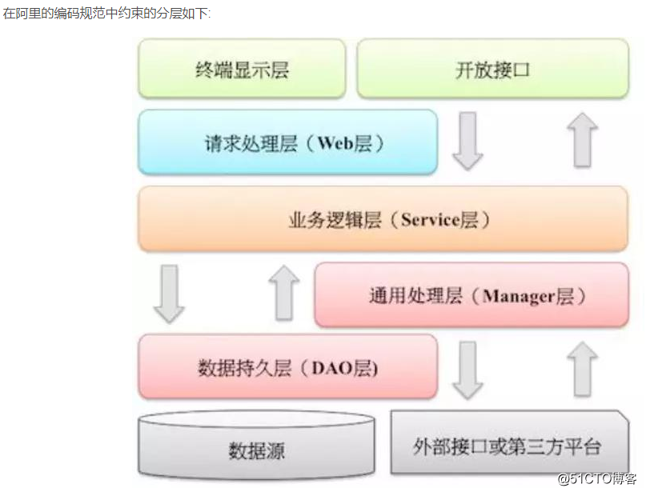

# 项目分包管理
## 代码分层
### manager层

Manager 层:通用业务处理层，

特征:

1. （三方封装）对第三方平台封装的层，预处理返回结果及转化异常信息
2. （通用下沉）对Service层通用能力的下沉，如缓存方案、中间件通用处理
3. （组合多dao）与DAO层交互，对多个DAO的组合复用。

### cola

参考资料
<https://blog.csdn.net/significantfrank/article/details/110934799>
